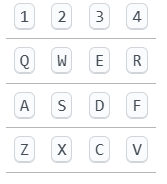

# Chip-8 Emulator

A simple Chip-8 emulator built with JavaScript and HTML5 Canvas.

---

## Features

- Load and run Chip-8 ROM files
- Adjustable emulation speed (Hz)
- Customizable display colors via RGB sliders
- Responsive canvas display
---
## Keyboard Controls

The Chip-8 uses a 16-key hexadecimal keypad. The keys are mapped to your physical keyboard as follows(compatible for other layouts as well):

| Chip-8 Key | Keyboard Key |
|------------|--------------|
| 1          | 1            |
| 2          | 2            |
| 3          | 3            |
| C          | 4            |
| 4          | Q            |
| 5          | W            |
| 6          | E            |
| D          | R            |
| 7          | A            |
| 8          | S            |
| 9          | D            |
| E          | F            |
| A          | Z            |
| 0          | X            |
| B          | C            |
| F          | V            |



## Installation & Development

1. Clone the repository:

```bash
git clone https://github.com/your-username/your-repo-name.git
cd your-repo-name
```
2. Install dependencies:

```bash
npm install
```
3. Run the development server (if you have one set up):

```bash

npm start
```
4. Build the project for production:

```bash
npm run build
```